# 🛍️ API de Produtos

[](https://laravel.com)
[](https://php.net)

API RESTful para gerenciamento de produtos desenvolvida em Laravel, seguindo os princípios de **Clean Architecture** e **Repository Pattern**.

## ✨ Funcionalidades

- CRUD completo de produtos
- Padrão Repository para desacoplamento do banco de dados
- Camada de Serviço para regras de negócio
- DTOs (Data Transfer Objects) para validação de dados
- Documentação de endpoints via Postman
- Migrations e Seeders para configuração do banco

## 🚀 Instalação

```bash
# Clone o repositório
git clone https://github.com/seu-usuario/product-api.git

# Acesse a pasta
cd product-api

# Instale as dependências
composer install

# Configure o ambiente (copie .env.example)
cp .env.example .env

# Gere a chave da aplicação
php artisan key:generate

# Execute as migrations (crie o banco antes)
php artisan migrate

```


---
## 📦 Dependências

- PHP >= 8.1
- Laravel 10
- MySQL/PostgreSQL/SQLite
- Composer (Gerenciador de dependências)

---

## 🔍 Endpoints

| Método   | URL                     | Descrição                     |
|----------|-------------------------|-------------------------------|
| `GET`    | `/api/v1/products`      | Lista todos os produtos       |
| `GET`    | `/api/v1/products/{id}` | Busca produto por ID          |
| `POST`   | `/api/v1/products`      | Cria novo produto             |
| `PUT`    | `/api/v1/products/{id}` | Atualiza produto existente    |
| `DELETE` | `/api/v1/products/{id}` | Remove produto                |

**Exemplo de Request (POST):**
```json
{
    "name": "Smartphone",
    "price": 1999.90,
    "description": "Modelo XYZ, 128GB"
}
});
```

## 🛠️ Tecnologias

- **Laravel 12** - Framework PHP para desenvolvimento web  
- **Eloquent ORM** - Camada de acesso a dados do Laravel  
- **Repository Pattern** - Padrão para isolamento da lógica de banco  
- **Postman** - Ferramenta para testes e documentação de APIs  
- **MySQL** - Banco de dados relacional utilizado  

---

## 📂 Estrutura do Projeto

```plaintext
app/
├── Http/           # Controllers e rotas
├── Models/         # Entidades do banco
├── Repositories/   # Implementações de repositórios
├── Services/       # Lógica de negócio
├── Interface/      # Interface
config/             # Configurações da aplicação
database/           # Migrations
routes/             # Definição de endpoints
```
## 🧩 Diagrama UML

```mermaid
classDiagram
    %% Controlador
    class ProductController {
        +index(): ProductResponse[]
        +show(id): ProductResponse
        +store(request): ProductResponse
        +update(id, request): ProductResponse
        +destroy(id): void
    }

    %% Serviço
    class ProductService {
        +getAllProducts(): Product[]
        +getProductById(id): Product
        +createProduct(request): Product
        +updateProduct(id, request): Product
        +deleteProduct(id): void
    }

    %% Repositório (Interface)
    class ProductRepository {
        +findAll(): Product[]
        +findById(id): Product
        +save(product): Product
        +delete(id): void
    }

    %% Repositório Eloquent (Implementação)
    class EloquentProductRepository {
        +findAll(): Product[]
        +findById(id): Product
        +save(product): Product
        +delete(id): void
    }

    %% Entidade
    class Product {
        +id: UUID
        +name: String
        +price: Decimal
        +categoryId: UUID
        +supplierId: UUID
    }

    %% Relacionamentos
    ProductController --> ProductService : usa
    ProductService --> ProductRepository : depende
    EloquentProductRepository ..|> ProductRepository : implementa
    ProductService --> Product : manipula


```



